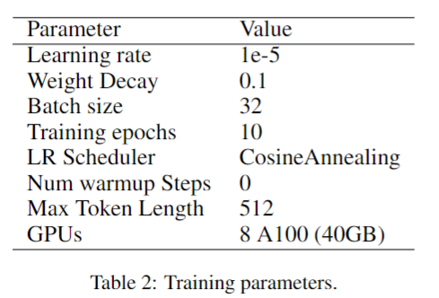
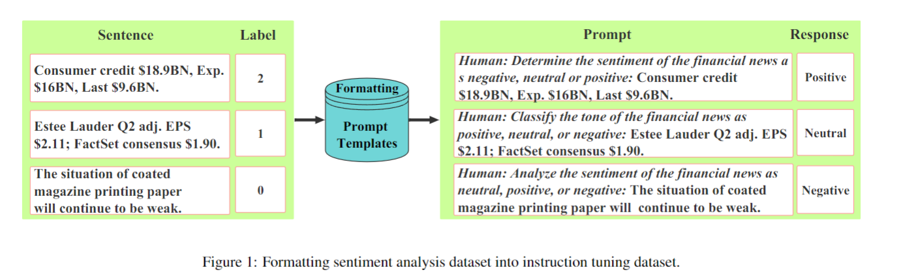
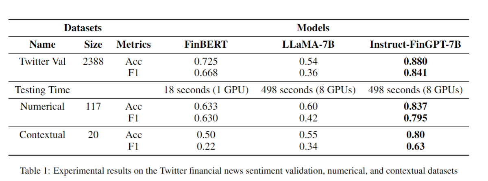
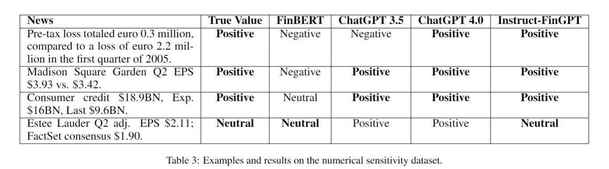
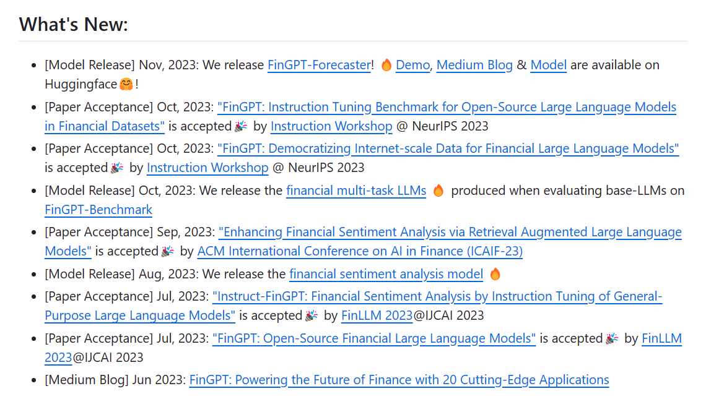

# Instruct-FinGPT: Financial Sentiment Analysis by Instruction Tuning of General-Purpose Large Language Models

two question proposed:
1) How to enable LLMs to address the issue of numerical sensitivity in financial sentiment analysis? and 
2) What is the role of contextual understanding in improving financial sentiment analysis?

key Idea: instruction tuning [Wei etal., 2022] a **pre-trained LLM (namely LLaMA [Touvron etal., 2023])**. Through this approach, we transform the classification based **sentiment analysis dataset into a generation task**, thereby allowing LLMs to apply their extensive training and superior analytical capabilities more effectively.

Enhance the performance in financial sentiment analysis by **minimizing the requirement of fine-tuning data and maximizing the contextual understanding and numerical sensitivity inherent to LLMs.**

1. 设计了一个针对金融情感分析的指令调优FinGPT模型，该模型在基准性能上超过了通用大型语言模型(LLMs)和最先进的监督模型，尽管只使用了少量的指令数据和训练资源。
2. 解决了金融情感分析中的数值敏感性问题，这是现有模型经常忽略的一个组成部分，提高了模型从金融新闻中准确解读情感的能力。
3. 强调了在金融情感分析中上下文理解的重要性，利用LLMs的固有通用知识，特别是在上下文缺失或模糊时，提高了情感分析的性能。

## dataset: financial sentiment analysis datasets.

Twitter Financial News dataset [Magic, 2022] and FiQA dataset [Maia et al., 2018], resulting in a comprehensive collection of 10, 501 samples.

train:
1. Twitter financial news sentiment training
2. FiQA dataset

validation:
1. Twitter financial news sentiment validation
2. Numerical sensitivity dataset
3. Contextual understanding dataset (contextual)
4. Financial PhraseBank (FPB) dataset

## What they have done

1. Formatting Financial Sentiment Analysis Dataset into Instruction Tuning Dataset.
   1. inputs are the financial news or headlines and the outputs are integer-type labels representing positive, negative and neutral sentiments.
   2. shining point: 10 human-written instructions describing the task of financial sentiment analysis.
   
2. Instruction Tuning LLaMA-7B:
   1.  **we leverage instruction data, which typically includes numeric values, financial context, and financial jargon, to provide supervised signals. Through instruction tuning, we align the LLM’s capabilities with the sentiment analysis labels, achieving a more precise and nuanced understanding of sentiments expressed in financial texts which enables it** to outperform both pretrained LLMs and supervised models specifically designed for financial sentiment analysis.(亮点:通过使用包含数字值、金融背景和金融术语的指令数据来提供监督信号，利用指令调优来对齐LLM的能力与情感分析标签，从而实现对金融文本中表达的情绪的更精确和细腻的理解，使其能够超越预训练的LLMs和专为金融情感分析设计的监督模型。)训练过程中存在亮点。
   2. 这是一种与监督微调紧密相连的方法。特别采用格式化实例对LLaMA-7B LLM进行监督学习方法的微调，即使用序列到序列的损失进行训练。
3. Mapping the Generated Outputs into Sentiment Labels
   1.  it still has the possibility of generating freestyle text. Therefore, we need to map the model’s output back to the specified three emotions for proper evaluation. method: **if the model’s output contains ”positive,” ”negative,” or ”neutral” terms, we map it to the corresponding label; otherwise, we consider it as ”neutral” sentiment.**(这个部分可能可以加以改进)

# Performance evaluation:

Three ways to compare the result:
general sentiment analysis, numerical understanding, and general knowledge supplementing.

## Bseline Models:
1. LLaMA-7B
2. FinBERT
3. ChatGPT

**[FinGPT](https://github.com/AI4Finance-Foundation/FinGPT)**

感觉我们应该改名：CoinGPT

# Proposed Idea

1. 训练数据中，采用一定比例，利用AI进行语句续写，并且加入Tag,标记为指导语句
2. 利用指导语句进行AI训练的测试, 查看是否具有性能的提升. 
3. 继续阅读论文。

